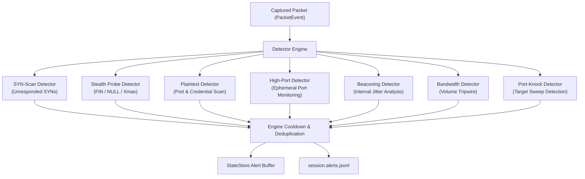
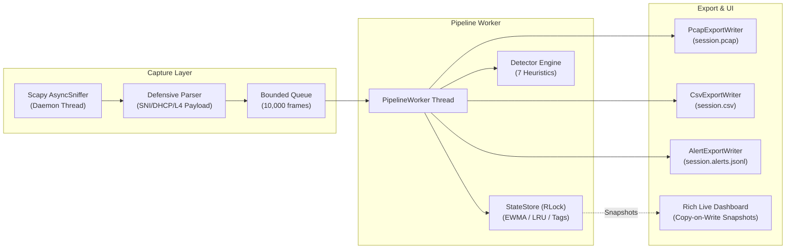

```
 ██████╗  █████╗ ███╗   ██╗ ██████╗ ██████╗ ████████╗██╗ ██████╗ ██████╗ ███╗   ██╗
 ██╔══██╗██╔══██╗████╗  ██║██╔═══██╗██╔══██╗╚══██╔══╝██║██╔════╝██╔═══██╗████╗  ██║
 ██████╔╝███████║██╔██╗ ██║██║   ██║██████╔╝   ██║   ██║██║     ██║   ██║██╔██╗ ██║
 ██╔═══╝ ██╔══██║██║╚██╗██║██║   ██║██╔═══╝    ██║   ██║██║     ██║   ██║██║╚██╗██║
 ██║     ██║  ██║██║ ╚████║╚██████╔╝██║        ██║   ██║╚██████╗╚██████╔╝██║ ╚████║
 ╚═╝     ╚═╝  ╚═╝╚═╝  ╚═══╝ ╚═════╝ ╚═╝        ╚═╝   ╚═╝ ╚═════╝ ╚═════╝ ╚═╝  ╚═══╝
```

<div align="center">

### A real-time terminal network traffic analyzer and lightweight intrusion detection system (NIDS).

[](https://github.com/Luciano-Sparti/panopticon/actions/workflows/ci.yml)
[](https://www.python.org/)
[](https://rich.readthedocs.io/)
[](https://scapy.net/)
[](LICENSE)
[](#-platform-support)

<br/>

> *All traffic observed. Anomalies highlighted. Threats contained.*

<br/>

[Overview](#-overview) • [Why Panopticon](#-why-panopticon) • [Features](#-features) • [Installation](#-installation) • [Quick Start](#-quick-start) • [Interactive Controls](#-interactive-controls) • [Detection Engine](#-detection-engine) • [Architecture](#-architecture)

</div>

---

> ⚠️ **Authorized-Use Notice**: Only capture and inspect traffic on networks and systems you own or have explicit authorization to monitor. Unauthorized packet interception may violate computer crime and privacy statutes.

---

## 👁️ Overview

**Panopticon** is an interactive, multi-pane terminal network traffic analyzer and lightweight Network Intrusion Detection System (NIDS) built with Python, Scapy, and Rich.

Inspired by Jeremy Bentham's architectural concept of an all-seeing observation tower, Panopticon provides a single, unified vantage point over your system's network activity. Without leaving your terminal, you can watch real-time packet flows, track top-talker telemetry, inspect protocol distributions, catch stealth port scans and cleartext credential leaks, and investigate individual hosts in forensic detail.

---

## 💡 Why Panopticon?

| Capability | Panopticon | Traditional CLI Tools (`tcpdump`, `tshark`) | Desktop GUIs (Wireshark) | Terminal Monitors (`iftop`, `nethogs`) |
| :--- | :--- | :--- | :--- | :--- |
| **Interface** | **Interactive 4-Pane TUI** with live freeze, panel zoom & search | Non-interactive scrolling stdout stream | Heavy desktop GUI application | Simple bandwidth-only terminal table |
| **Threat Detection** | **Built-in NIDS Engine** (SYN-scans, stealth probes, beacons, cleartext) | None (pure packet dumper) | Passive dissection filters only | None |
| **Deep Host Inspection** | **Modal Host Inspector** (Sessions, ports, protocol mix, reverse DNS) | Manual shell pipeline filtering | Multi-window dialog drilldowns | Process or IP summary only |
| **Dual Exporters** | **Streaming PCAP, CSV & JSONL** simultaneously off-thread | Single PCAP or text stream | Manual export dialogs | None |
| **Local Attribution** | **Kernel-Direct Flow-to-PID Mapping** with scoped flow kill | None | None | Bandwidth per PID only |

---

## ✨ Features

### 📡 High-Throughput Packet Ingestion
- **Asynchronous Decoupled Capture**: Runs Scapy's `AsyncSniffer` in a dedicated background daemon thread with non-blocking queueing, preventing packet drops during network bursts.
- **Fail-Fast BPF Preflight**: Validates Berkeley Packet Filter (BPF) expressions up-front before starting capture to prevent runtime capture errors.
- **Wire-Fidelity Extraction**: Captures raw byte fidelity (`pkt.original`) directly into streaming PCAP output without re-serialization artifacts.

### 📊 Real-Time Interactive Dashboard
- **4-Pane Live Layout**: Live packet stream, ranked top talkers, real-time EWMA velocity telemetry, and active security alerts.
- **Single-Pane Zoom Modes**: Focus instantly into any panel (`1` Stream, `2` Talkers, `3` Alerts, `4` Telemetry) with `Tab` or number keys.
- **Live Stream Freeze**: Hit `Space` to freeze the packet stream for forensic inspection while background capture continues uninterrupted.
- **Top-Talker Normalization**: Visual activity block bars normalized against a decaying peak (`PEAK_DECAY`) so transient spikes remain comparable.

### 🛡️ Heuristic Intrusion Detection (NIDS)
- **TCP SYN-Scan Detection**: Flags sources spraying unresponded SYNs across targets over sliding time windows.
- **Stealth Probe Scans**: Identifies FIN-only, NULL (`""`), and Xmas (`FPU`) scans designed to evade basic stateful firewalls.
- **Beaconing & C2 Heartbeats**: Statistical inter-arrival jitter analysis (`fmean`) detecting automated periodic connections.
- **Cleartext Credential Exposure**: Real-time payload inspection surfacing unencrypted protocols and exposed authorization headers (`Authorization:`, `USER`, `PASS`).
- **Horizontal Port Sweeps**: Catches port-knocking and connect-sweep sweeps against local hosts.
- **Bandwidth Abuse Tripwire**: Triggers alerts when a host exceeds volume-per-window thresholds.

### 🔍 Deep Host Inspector & Identity
- **Modal Drilldown**: Press `Enter` on any talker to open a deep-dive modal showing active sessions, contacted ports, classification, and alert history.
- **Hostname Intelligence**: Learns hostnames directly from TLS `ClientHello` SNI and DHCP Option 12 leases on the wire, supplemented by non-blocking background reverse-DNS.
- **Automatic Self-Tagging**: Host-owned IPs are detected straight from the kernel (`/proc`) and tagged as `self:<hostname>` (or `self:localhost`).
- **Scoped Flow Termination**: Optional process identification (`k` / `--enable-kill`) resolving the local PID owning a connection directly from `/proc` socket inodes with `y/n` confirmation.

### 🗄️ Forensics & Streaming Export
- **Concurrent PCAP Writer**: Writes raw captured frames with automatic DLT link-layer inference (`Ethernet`, `IPv4`, `IPv6`).
- **Flow CSV Log**: Streams per-packet flow records (`ts`, `src`, `dst`, `proto`, `sport`, `dport`, `service`, `size`) in append-only CSV form.
- **Alert JSONL Stream**: Streams security alerts into machine-parseable JSONL format (`session.alerts.jsonl`) for SIEM integration.

---

## 🚀 Installation

### 1. Quick Install (Linux / macOS)

Install the latest release with isolated dependencies and launcher binary in a single command:

```bash
curl -sSL https://raw.githubusercontent.com/luciano-sparti/panopticon/main/install.sh | bash
```

### 2. Via `pipx` (Isolated CLI Application)

[`pipx`](https://pypa.github.io/pipx/) installs Panopticon into an isolated environment and adds the `panopticon` command directly to your `$PATH`:

```bash
pipx install panopticon
# or from GitHub directly:
pipx install git+https://github.com/luciano-sparti/panopticon.git
```

### 3. Via `uv`

```bash
uv tool install panopticon
```

### 4. From Source

```bash
# 1. Clone the repository
git clone https://github.com/luciano-sparti/panopticon.git
cd panopticon

# 2. Create and activate virtual environment
python3 -m venv .venv
source .venv/bin/activate    # On Windows: .venv\Scripts\activate

# 3. Install Panopticon
pip install .

# Optional: Install development & testing tooling
pip install ".[dev]"
```

---

## 🎮 Quick Start

### 1. Run with Elevated Privileges

```bash
# Linux (option A: run through sudo with venv python)
sudo "$VIRTUAL_ENV/bin/python" -m panopticon.analyzer

# Linux (option B: grant capture capabilities once, then run normally)
sudo setcap cap_net_raw,cap_net_admin=eip "$(readlink -f "$VIRTUAL_ENV/bin/python")"
python -m panopticon.analyzer
```

```bash
# macOS
sudo "$VIRTUAL_ENV/bin/python" -m panopticon.analyzer
```

```powershell
# Windows (in Administrator Terminal)
python -m panopticon.analyzer
```

### 2. Common Usage Patterns

```bash
# Sniff a specific interface (e.g. eth0) with a BPF filter
sudo "$VIRTUAL_ENV/bin/python" -m panopticon.analyzer -i eth0 --filter "tcp port 80 or tcp port 443"

# Background reverse-DNS hostname resolution
sudo "$VIRTUAL_ENV/bin/python" -m panopticon.analyzer --resolve-hosts

# Custom export locations for PCAP and flow logs
sudo "$VIRTUAL_ENV/bin/python" -m panopticon.analyzer --export-pcap /tmp/capture.pcap --export-csv /tmp/flows.csv

# Persist talker tags across restarts
sudo "$VIRTUAL_ENV/bin/python" -m panopticon.analyzer --tags-file ~/.panopticon_tags.json

# Headless mode for CI / scripts (no TUI)
sudo "$VIRTUAL_ENV/bin/python" -m panopticon.analyzer --no-ui
```

---

## ⌨️ Interactive Controls

The dashboard is non-blocking and fully controllable via hotkeys:

```
┌───────────────────────────────── Panopticon Dashboard ──────────────────────────────────┐
│ [1] Stream (LIVE)                                                                       │
│  Time          Dir  Source           Destination      Proto  Ports       Size  Service  │
│  22:45:01.102   ▲   192.168.1.50     142.250.190.46    TCP   54210→443    512  https    │
│  22:45:01.108   ▼   142.250.190.46   192.168.1.50      TCP   443→54210   1420  https    │
├──────────────────────────┬───────────────────────────┬──────────────────────────────────┤
│ [2] Top Talkers (Bytes)  │ [4] Telemetry             │ [3] Alerts (1 crit / 3 total)    │
│  Host          Packets   │  Metric            Value  │  Time      Sev   Kind   Summary  │
│ ▸ 142.250...     1,240   │  Packets/sec       142.5  │  22:44:59  warn  syn_   unresp.. │
│   192.168...       980   │  Bytes/sec     182.4 KiB  │  22:45:00  crit  plain  PASS ... │
└──────────────────────────┴───────────────────────────┴──────────────────────────────────┘
  q quit | ↑/↓ select | Space freeze | m metric | 1-4 zoom | Enter inspect | p pin | ? help
```

| Key | Action | Description |
| :--- | :--- | :--- |
| `q` / `Ctrl+C` | **Quit** | Drains queues, closes capture sockets, and flushes all exports to disk. |
| `↑` / `↓` (or `j` / `k`) | **Select Talker** | Moves the cursor highlight across top talkers. |
| `Space` | **Freeze / Resume** | Freezes the stream display for inspection (`PAUSED` ⇄ `LIVE`). |
| `m` | **Toggle Metric** | Toggles talker sorting between **Bytes** and **Packets**. |
| `1` – `4` | **Zoom Panel** | Zooms into **1** (Stream), **2** (Talkers), **3** (Alerts), or **4** (Telemetry). |
| `0` / `Tab` | **Restore / Cycle** | Restores the default 4-pane layout or cycles through zoom views. |
| `Enter` | **Host Inspector** | Opens the deep-dive modal for the selected talker (`Enter`/`Esc` to close). |
| `p` | **Pin / Unpin** | Pins the selected talker to the top of the list. |
| `t` / `T` | **Tag / Untag** | Opens an inline footer prompt to attach or detach custom IP tags. |
| `!` | **Filter Alerts** | Cycles alert severity filter (`All` $\rightarrow$ `Warn+` $\rightarrow$ `Critical`). |
| `k` / `x` | **Scoped Kill** | Resolves local process owning the selected flow and prompts for `y/n` SIGTERM. |
| `?` | **Help Overlay** | Toggles the full-screen keybinding cheat sheet. |
| `Esc` | **Dismiss** | Closes active overlay, clears selection, or cancels prompts. |

---

## ⚙️ Configuration Reference

Options can be set via CLI flags or declared in a `panopticon.toml` config file:

```toml
# panopticon.toml
interface = "eth0"
filter = "tcp or udp"
refresh = 0.5
queue_size = 10000

# Detection thresholds
syn_threshold = 20
syn_window = 5.0
probe_threshold = 15
probe_window = 5.0
high_port = 49152
alert_cooldown = 30.0
bandwidth_threshold = 100000000

# Feature toggles
resolve_hosts = true
enable_kill = false
export_pcap = "session.pcap"
export_csv = "session.csv"
export_alerts = "session.alerts.jsonl"
```

### CLI Flag Reference

| Flag | Short | Description | Default |
|---|---|---|---|
| `--config` | | Path to TOML config file | `panopticon.toml` |
| `--interface` | `-i` | Network interface to sniff on | Auto-detected |
| `--filter` | | BPF packet filter expression (e.g. `"tcp port 80"`) | None |
| `--refresh` | | State store maintenance interval (seconds) | `0.5` |
| `--queue-size` | | Ingestion queue depth before dropping frames | `10000` |
| `--syn-threshold` | | Unresponded SYNs triggering scan alert | `20` |
| `--syn-window` | | Sliding window (s) for SYN scanning | `5.0` |
| `--high-port` | | Port threshold for high-port alerts | `49152` |
| `--alert-cooldown` | | Cooldown between identical alerts (s) | `30.0` |
| `--resolve-hosts` | | Enable background reverse DNS lookups | Off |
| `--enable-kill` | | Enable scoped process termination key (`k`) | Off |
| `--tags-file` | | JSON file path for persistent tags | None |
| `--no-ui` | | Headless mode (disables TUI for CI/scripts) | Off |

---

## 🛡️ Detection Engine

Panopticon runs seven heuristic detectors concurrently on every packet:



---

## 🏗️ Architecture



### Technical Highlights

- **Single-Pass Dissection**: Transport payload bytes are pre-extracted once during parsing on [`PacketEvent`](file:///home/aredain/Projects/panopticon/panopticon/core/event.py#L12-L46) to eliminate redundant layer slicing across detectors.
- **Copy-on-Write Snapshots**: All UI render methods consume lightweight shallow copies of immutable frozen dataclasses, completely preventing thread lock contention without paying for `deepcopy`.
- **Injected Monotonic Clock**: Detection sliding windows use packet timestamps while store housekeeping uses a monotonic clock ([`Clock`](file:///home/aredain/Projects/panopticon/panopticon/core/clock.py#L22-L41)) to prevent clock drift or NTP adjustments from corrupting state.
- **Kernel Introspection**: Process attribution walks `/proc/<pid>/fd` directly to match `/proc/net/{tcp,udp}` socket inodes without spawning external subshells (`ss`/`lsof`).

---

## 🧪 Testing & Verification

Panopticon includes a full test suite with unit, integration, and smoke test coverage:

```bash
# Run full unit and integration tests
pytest

# Run type checking
mypy panopticon

# Run linter
ruff check panopticon

# Run full automated tour demo
./demo.sh
```

---

## 🗺️ Platform Support

- **Linux** (x86_64, aarch64): Full native support including direct `/proc` process resolution.
- **macOS** (Apple Silicon, Intel): Full capture, TUI, and export support.
- **Windows**: Full capture (via Npcap), interactive keyboard (`msvcrt`), and export support.

---

## 🤝 Contributing

Contributions, bug reports, and suggestions are welcome!

1. Fork and clone the repository.
2. Create a virtualenv: `python3 -m venv .venv && source .venv/bin/activate`
3. Install development dependencies: `pip install ".[dev]"`
4. Run tests and lint checks: `pytest && ruff check panopticon && mypy panopticon`
5. Open a pull request against `main`.

---

## 📜 License

Distributed under the **MIT License**. See [LICENSE](LICENSE) for details.  
*Strictly for authorized defensive network monitoring and educational security research.*

